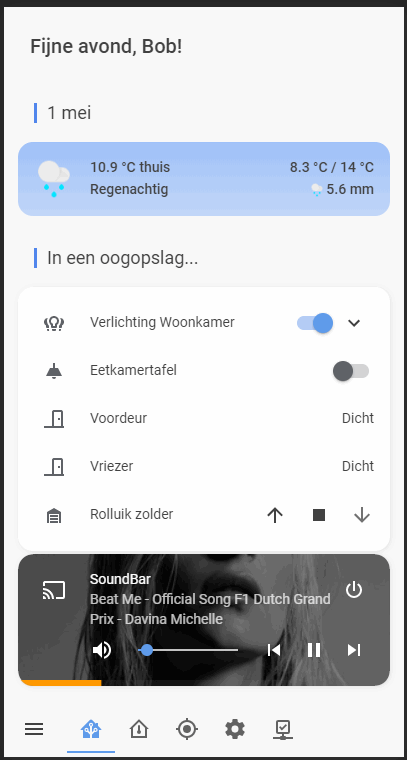

This repo contains my Home Assistant configuration. Home Assistant is open source home automation that puts local control and privacy first. More information can be found at their website, https://www.home-assistant.io.

I started with Home Assistant back in 2018 somewhere, running it in a [Python venv](https://www.home-assistant.io/docs/installation/virtualenv/) directly at a Raspbian installation. I ran into all kind of compatibility issues in the long run, so I decided to switch to a [Docker based setup](https://www.home-assistant.io/docs/installation/docker/) in July 2019. Ever since starting with my home automation project, I've been making changes weekly and sometimes daily. However, I don't always commit directly to Github (sorry...) so changes may flow in a bit slower.

# My Home Automation Vision
My vision is that my Home Automation should always work, even when the internet is down and always should have a manual backup. The house should still be fully functional for me, the others living with me but also my non-tech grandma. That results into choosing solutions that don't use cloud services if not necesarry and that all lights still can always be switched manually. Therefore I use [Qubino Zwave modules](https://qubino.com/), enabling me to switch lights manually and 'smart', and some [ESPhome](https://esphome.io/) flashed [Sonoff modules](https://sonoff.itead.cc/en), which also come with a push button to switch the relays. A notable exception to this is the [Google Assistant integration](https://www.home-assistant.io/components/google_assistant/), which obviously requires a connection to Google.

# My Home Assistant Infrastructure
## Main Hub
### Hardware
- Raspberry Pi3B+
- [Z-Wave.Me ZME_UZB1 USB Stick](https://tweakers.net/pricewatch/434681/z-wave-punt-me-usb-stick-met-z-wave-plus/specificaties/)
- [CC2531 Zigbee stick](https://tweakers.net/aanbod/1992398/cc2531-zigbee-zigbee2mqtt-usb-stick.html) with [zigbee2mqtt](https://www.zigbee2mqtt.io/)

### Software
- [Raspbian](https://www.raspberrypi.org/downloads/raspbian/) Buster
- [Docker](https://www.docker.com/)
  - [Home Assistant Core](https://hub.docker.com/r/homeassistant/home-assistant) as core
  - [Mosquitto](https://hub.docker.com/_/eclipse-mosquitto) as local MQTT server
  - [Traefik](https://hub.docker.com/_/traefik) as transparant reverse proxy, handling traffic to all containers and SSL termination
  - [ESPhome](https://hub.docker.com/r/esphome/esphome) to program my sonoff devices
  - [zigbee2mqtt](https://hub.docker.com/r/koenkk/zigbee2mqtt) running my zigbee network
  - [Duplicati](https://hub.docker.com/r/duplicati/duplicati) for encrypted backups of my config files to the cloud
  - [nginx](https://hub.docker.com/r/linuxserver/nginx) for some static file hosting.

## Connected devices
### Z-Wave
 - 3x [Qubino Flush Dimmer](https://tweakers.net/pricewatch/467913/qubino-flush-dimmer-z-wave+/specificaties/) 1 for dining room, 1 for window light in living room and 1 for the hallway
 - 1x [NEO COOLCAM NAS-PD02Z Z-wave Plus PIR Motion Sensor](https://www.aliexpress.com/item/32796863408.html) in the living room - links to a V2 but I use the V1 which lacks temperature support
 - 1x [NEO COOLCAM NAS-PD02Z Z-wave Plus PIR Motion Sensor](https://www.aliexpress.com/item/32796863408.html) in the hallway - this actually is a V2
 - 1x [Qubino Flush 2 Relay](https://tweakers.net/pricewatch/474184/qubino-flush-2-relay-z-wave+/specificaties/) in the garden
 - 1x [Qubino Flush Shutter](https://tweakers.net/pricewatch/563345/qubino-flush-shutter-(zmnhcd1)/specificaties/) to control the cover on the attic windows
 
### Wifi Switches
 - 2x [Sonoff basic](https://www.aliexpress.com/item/32831445550.html) switches running ESPhome (so no connection with China!)
 - 2x [Sonoff S20](https://www.aliexpress.com/item/32846334606.html) switches also running ESPhome, 1 in use, 1 in spare for the Christmas lights.
 
### Zigbee sensors
 - 2x [Xiaomi mijia Temperature Humidity Sensor](https://www.aliexpress.com/item/32714410866.html), 1 in the attic, the other in the main bedroom
 - 2x [Xiaomi door Window Sensor](https://www.aliexpress.com/item/32714904459.html) (still on order), 1 is meant for the freezer upstairs because the kids tend to leave it not fully closed. For the other I have no purpose yet.
 
### Thermostat
 - Rooted Toon thermostat
   - Rooting enables local control of the thermostat, and prevents needing a subscription with Eneco. It requires a [custom_component](https://github.com/cyberjunky/home-assistant-toon_climate) (installed through [HACS](https://hacs.xyz/)).
   - Connecting to [emulated Hue on Home Assistant](https://github.com/hmmbob/HomeAssistantConfig/blob/master/includes/emulated_hue.yaml) for light switches.
 - The Toon Thermostat also provides information on my smartmeter, measuring electricity. It receives this information through the P1 port on the meter and pushes this to Home Assistant. This also requires a [custom component](https://github.com/cyberjunky/home-assistant-toon_smartmeter) to work (also easily installed through [HACS](https://hacs.xyz/)).
 
### Cast & Voice Control
- Google Home Hub in the living room
- AndroidTV in the living room TV
- LG SH-8 Soundbar with built-in cast in the living room
- Google Home in the study room
- 2x Google Home Mini upstairs
- Google Chromecast in my bedroom TV

# My actual Home Assistant configuration choices
## Presence detection
Presence detection is always an important issue with Home Automation, and I've struggled with it too. Recently I stepped away from using a combination of Owntracks and bluetooth tracking (I used [Monitor](https://github.com/andrewjfreyer/monitor)) in favor of the official [Home Assistant app](https://play.google.com/store/apps/details?id=io.homeassistant.companion.android), because this combination was not robust enough. We had a lot of issues with bluetooth interference (my smart watch lost connection to my phone _all the time_, and my wifes phone just disabled bluetooth over time). The Home Assistant app has been working flawlessly for the both of us so far! It connects directly to my own server, so no cloud integration needed. 

## Notifications
As added benefit of using the official Home Assistant app, I can easily push (actionable) notifications to our phones. Besides push notifications I also use TTS to our Google Home speakers for notifications. 

# My Lovelace setup
## Mobile, or not?
We are using Home Assistant mostly from our phones, so in April 2020 I decided to redo my frontend to a mobile only view. This allows me to just focus on making this view look and work good. After all, when using a desktop I am mostly tweaking my setup anyway and thus mostly using the developer tools. My Lovelace setup is *heavily* inspired by [jmart518](https://twitter.com/jmart518): I got triggerd by this [tweet](https://twitter.com/jmart518/status/1242464036454674432) of him.

## Resources
I've extended the possibilities of the standard Lovelace interface through multiple plugins installed through [HACS](https://hacs.xyz/). In my configuration I am using the following plugins:

- [Custom Header](https://github.com/maykar/custom-header), used to modify the header to display as footer and to display only a selection of panes in my wifes environment.
- [Lovelace Swipe Navigation](https://github.com/maykar/lovelace-swipe-navigation) which enables swiping through the different panes.
- [Card Mod](https://github.com/thomasloven/lovelace-card-mod) is used to tweak the CSS styles of all cards I use.
- [State Switch](https://github.com/thomasloven/lovelace-state-switch) can be used to display different cards based on the state of an entity. I am using it to display custom greetings to myself and my wife.
- [Fold entity row](https://github.com/thomasloven/lovelace-fold-entity-row) is a _really_ handy tool to have a fold out overview of entities. I am using it for my livingroom lights in the Home Screen, the gas prices in the Locations Pane and to fold the battery state overview (that uses the earlier mentioned Battery State Card) and the smart meter data in the status pane.
- [Simple Weather Card](https://github.com/kalkih/simple-weather-card) which beautifully displays the current weather for my location on the Home Screen.
- [Mini Media Player](https://github.com/kalkih/mini-media-player) The most beautiful and compact media player I saw around there. These are being displayed only conditionally: when one of the media players is playing something this card will show on the Home Screen.
- [Simple Thermostat](https://github.com/nervetattoo/simple-thermostat) is used to display the thermostat controls for my Toon thermostat.
- [Battery State Card](https://github.com/maxwroc/battery-state-card) is used for, well, displaying the battery states :)
- [Button Card](https://github.com/custom-cards/button-card), used for the buttons in the settings pane.
- [Mini Graph Card](https://github.com/kalkih/mini-graph-card) to display temperature graphs in the temperature pane.
- [Auto Entities](https://github.com/thomasloven/lovelace-auto-entities) A legacy plugin that I've used in my previous setup, but it is still handy to use in some occasions.

## Ok, enough talking - show me your setup!
Ready, set..... go!

### Home Screen

The Home Screen contains some information that is always displayed, it also contains _a lot_ of conditional cards. For instance, a reminder which trash should be put out will only be displayed on the day it will be collected. Media player controls will only appear when one of the media players is actually playing some media and remain hidden when in stand-by. Light controls for the lights part of the group "living room" are hidden with a "fold-entity-row" element. This greatly compacts the screen estate needed while still being able to toggle individual lights if we want to.

### Temperature pane
In the temperature pane I have the controls for the thermostat and the different temperature graphs for the house. See the swiping image.

### Location pane

The location pane also uses a "fold-entity-row" element to display if we are at home and to display some diesel/gas prices around our area. It also displays the geocoded location of my phone - both as text and a map image - so my wife knows when to start cooking when I return home ;-)

### Settings pane

The settings pane contains 9 custom:button-cards to toggle some input-booleans that enable/disable certain functions in the house. Think of light automations based on movement and the ability of disabling the front door bell or the automations of the cover in the attic.

### Status pane 

The status pane is only displayed to me and shows some diagnostics of the system. It tells me the battery levels of the different wireless sensors in the house and if certain devices are still online. It will also list the current installed and latest available docker images and if HACS has any updates pending. It also shows the smartmeter power usage - using a state switch card it either displays the normal or low tariff sensor as header of the entity fold.
